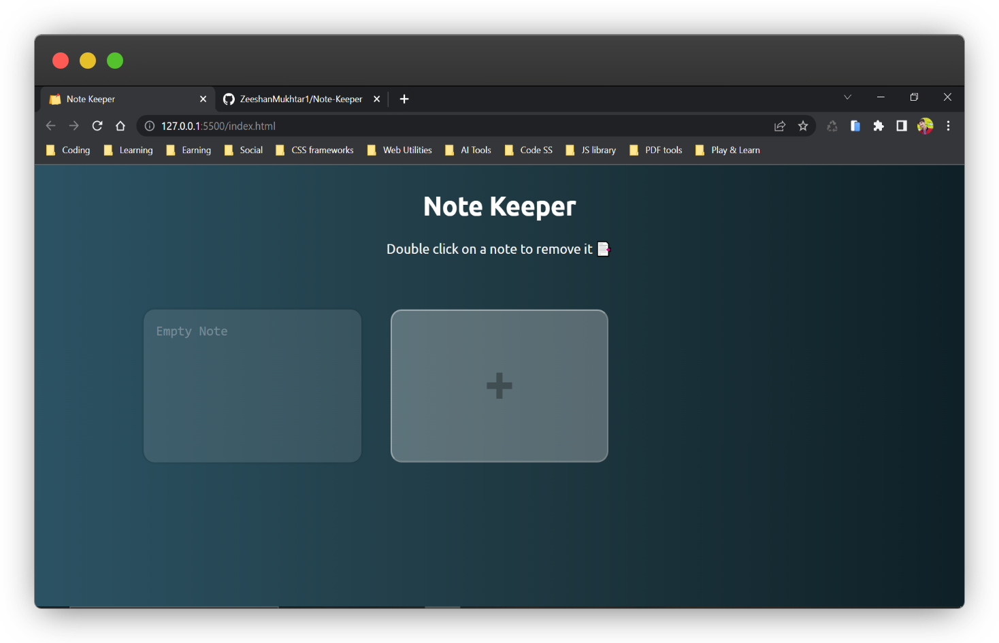

# Note Keeper

Note Keeper is a simple web application for taking notes. It allows you to create, edit, and delete notes, and saves them locally using the browser's localStorage feature. The app is built using HTML, CSS, and JavaScript.

To view this project live, please visit [this link](https://zeeshanmukhtar1.github.io/Note-keeper-App/).

## Features

- Create new notes
- Edit existing notes
- Delete notes
- Save notes locally
- Double-click to delete a note
- Input change event to update note content

## Usage

To create a new note, click the "Add Note" button. To edit a note, simply click on the note's text area and start typing. To delete a note, double-click on the note's text area and confirm the action. The app automatically saves your notes locally using the browser's localStorage feature, so your notes will be there even after you close the app.

## Contributing

Contributions are welcome! If you would like to contribute to the project, please submit a pull request or contact the [maintainer](https://www.linkedin.com/in/zeeshanmukhtar1/).

## Credits

This app was created by [Zeeshan Mukhtar](https://www.instagram.com/zeshanmukhtar01/). It is based on a tutorial by [Sahandghavidel](https://avatars.githubusercontent.com/u/71052435?v=4) and uses the following technologies:

- HTML
- CSS
- JavaScript

### Screenshot

### Connect With ME

